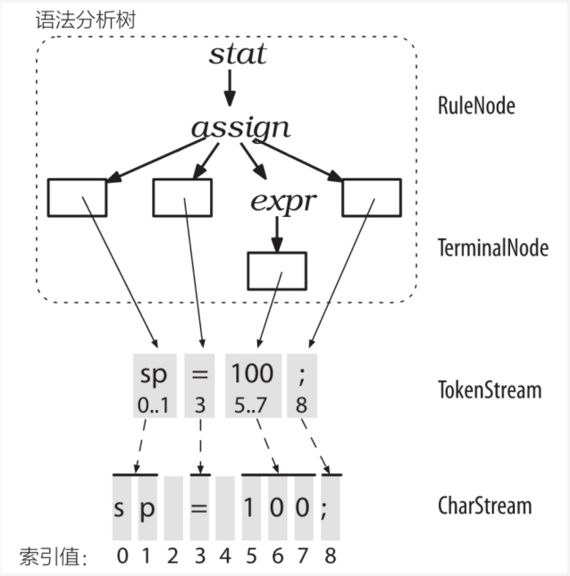
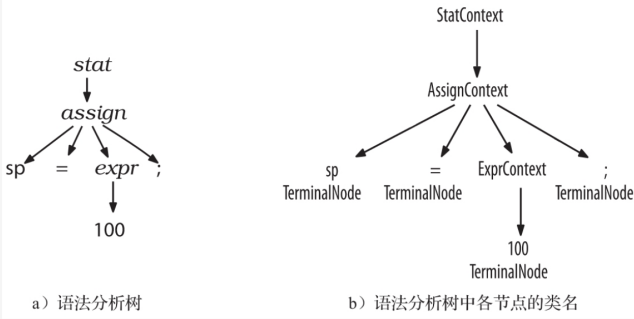
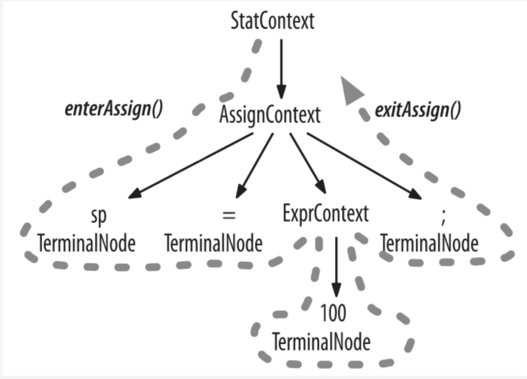
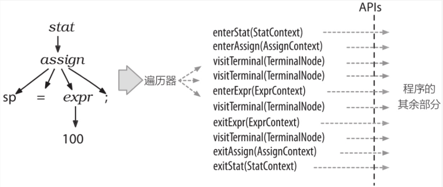
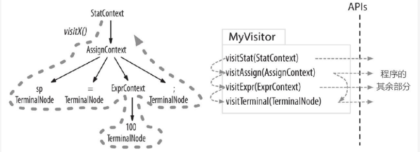

# 安装及测试
https://blog.csdn.net/weixin_52224421/article/details/124900287

# 编译

## 命令行

如上教程创建antlr4.bat和grun.bat，并添加到系统path中

假设我们创建了名为Hello.g4的文件，依次输入以下命令

```
antlr4 Hello.g4
javac Hello*.java
grun Hello rr -tree(rr为Hello.g4中想要匹配的规则的名称)(接下来输入要匹配的文本，以ctrl z结束)
grun Hello rr -gui(接下来输入和上述一样的文本，以ctrl z结束)
```

成功的话将会显示语法分析树的图形化界面

-tree：生成语法分析树

-gui：在对话框中以可视化方式显示语法分析树

## idea中

1.测试

在idea中装.g4文件的插件，在.g4文件中需要测试的规则处右键，再点击 Test Rule xxx 即可直接测试

2.生成相应文件

在idea中，右击.g4文件，Configure ANTLR出配置输出路径

再右击.g4文件，Generate ANTLR Recognizer

https://blog.csdn.net/Sisyphus_98/article/details/105518652

3.使用Maven管理项目

https://blog.csdn.net/m0_67392409/article/details/124108014


# 基本语法

参考书目：《antlr4语法指南》

一些术语：语言，语法，语法分析树，词法符号，lexer，parser，自顶向下的语法分析器(?)，递归下降的语法分析器，前向预测(语法分析器通过接下来的token预测选择向哪递归)，token(词素)


使用实例 Hello.g4

```
// Define a grammar called Hello
grammar Hello;
r:'Hello' ID;         // match keyword hello followed by an identifier
ID:[a-z]+;             // match lower-case identifiers
WS:[ \t\r\n]+ -> skip; // skip spaces, tabs, newlines
```

**一些基本语法 ** 

```
r:'Hello' ID
 |'Hello2' ID
 |'Hello3' ID ';'
 ;
//多个备选分支
```

**一些注意点** 

* 大写字母开头为语法，小写字母开头为词法
* WS的作用是分割token词素(每一块中仍可能有多个词素拼接)，token通过lexer中的词法确定自己是什么词类型(词法记号)，parser再对lexer给出的一串词法记号流(解析过的token流)进行分析


* 语法/词法不能有歧义，但歧义可通过优先级解决并利用(如，1.词法分析器的歧义，antlr会选择最靠前的词法规则；2.语法分析器的歧义，antlr会选择最靠前的备选分支)

  ```
  Begin:'begin';
  ID:[a-z]+;
  ```

  若匹配begin，会匹配Begin

* lexer会选择匹配可能的最长字符串(字符串指被WS分割的某一部分)

  ```
  Begin:'begin';
  ID:[a-z]+;
  ```

  若匹配beginner，会匹配ID,而不是拆成begin+ner去匹配Begin+ID

  但若是匹配begin ner，会匹配Begin+ID

# 调用生成的语法分析树(.java文件)

## 语法生成树

对于语法生成树中的每一个非叶节点(规则)，都会生成一个单独的RuleNode的子类，如规则stat会生成StatContext的类

对于语法生成树中的每一个叶节点(词素)，都会生成一个TerminalNode类

RuleNode和TerminalNode都是ParseNode的子类








## listener 监听器

antlr为每个语法文件生成一个ParseTreeListener的子类

该类中，每一个非叶节点(规则)都有一个单独的enter方法和exit方法，如规则stat会生成enterStat(),exitStat()





antlr运行库提供ParseTreeWalker类，它会对语法分析树进行DFS，依次执行每个规则的enter方法和exit方法

listener的优秀之处在于，DFS是自动进行的，即我们不需要写DFS相关的代码





## vistor 访问器

每一个非叶节点(规则)都有一个单独的visit方法，如规则stat会生成vistStat()

特别的，叶节点(token)也有一个visit方法，名为visitTerminal()


antlr运行库提供MyVisitor类，通过调用visit()方法开始对语法分析树进行一次DFS





